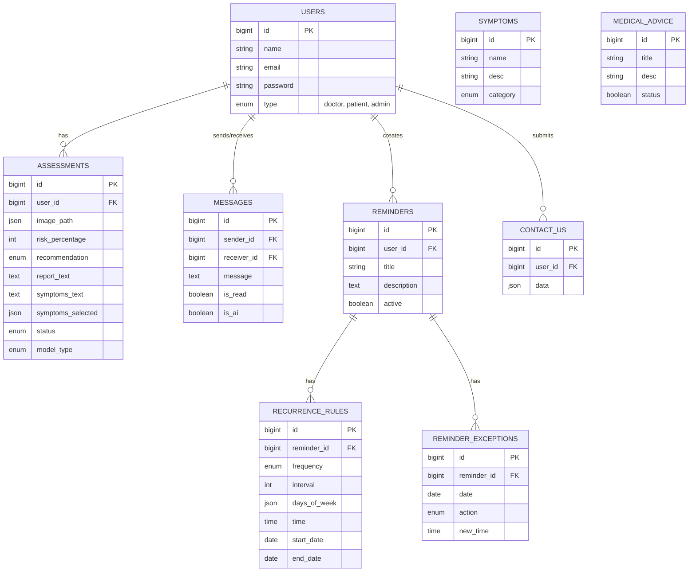

# Database Documentation

This document provides a comprehensive overview of the database schema for the application. It details the tables, their columns, and the relationships between them.

  

## Overview

  

The database is designed to support a medical application connecting patients, doctors, and admins. It handles user authentication, medical assessments (AI-based), real-time messaging, reminders, and general content like symptoms and medical advice.

  

## Entity Relationship Diagram

  

  

## Table Details

  

### 1. Users (`users`)

Stores all system users including patients, doctors, and administrators.

| `id` | BigInt (PK) | Unique identifier |

| `name` | String | User's full name |

| `email` | String | Unique email address |

| `password` | String | Hashed password |

| `type` | Enum | User role: `patient`, `doctor`, `admin` |

| `email_verified_at` | Timestamp | Date of email verification |

  

### 2. Assessments (`assessments`)

Stores medical assessments performed by users, potentially using AI models.

| `id` | BigInt (PK) | Unique identifier |

| `user_id` | BigInt (FK) | The user who performed the assessment |

| `image_path` | JSON | Paths to uploaded images |

| `risk_percentage` | Integer | Calculated risk score (0-100) |

| `recommendation` | Enum | Advice: `take_precautions`, `take_precautions_and_see_doctor`, `see_doctor` |

| `report_text` | Text | Detailed report content |

| `symptoms_text` | Text | User-described symptoms |

| `symptoms_selected` | JSON | List of selected symptoms (IDs or names) |

| `status` | Enum | `pending`, `completed`, `cancelled` |

| `model_type` | Enum | AI model used: `model_image`, `model_text`, `both`, `other` |

  

### 3. Messages (`messages`)

Handles real-time chat between users (e.g., patient-doctor) or AI interactions.

| `id` | BigInt (PK) | Unique identifier |

| `sender_id` | BigInt (FK) | User sending the message |

| `receiver_id` | BigInt (FK) | User receiving the message (nullable for AI/broadcast) |

| `message` | Text | Content of the message |

| `is_read` | Boolean | Read status |

| `is_ai` | Boolean | Indicates if the message was generated by AI |

  

### 4. Reminders (`reminders`)

Stores base information for user reminders (e.g., medication).

| `id` | BigInt (PK) | Unique identifier |

| `user_id` | BigInt (FK) | Owner of the reminder |

| `title` | String | Reminder title |

| `description` | Text | Additional details |

| `active` | Boolean | Whether the reminder is currently active |

  

### 5. Recurrence Rules (`recurrence_rules`)

Defines the schedule for reminders (e.g., daily, weekly).

| `id` | BigInt (PK) | Unique identifier |

| `reminder_id` | BigInt (FK) | Linked reminder |

| `frequency` | Enum | `daily`, `weekly`, `monthly`, `yearly`, `custom` |

| `interval` | Integer | Repetition interval (e.g., every 2 days) |

| `days_of_week` | JSON | Specific days for weekly recurrence (e.g., [1,3,5]) |

| `days_of_month` | JSON | Specific days for monthly recurrence |

| `months_of_year` | JSON | Specific months for yearly recurrence |

| `time` | Time | Time of the reminder |

| `start_date` | Date | When the recurrence starts |

| `end_date` | Date | When the recurrence ends (nullable) |

  

### 6. Reminder Exceptions (`reminder_exceptions`)

Handles exceptions to the standard recurrence rules (e.g., skipping a specific day).

| `id` | BigInt (PK) | Unique identifier |

| `reminder_id` | BigInt (FK) | Linked reminder |

| `date` | Date | The specific date of the exception |

| `action` | Enum | `skip` (cancel instance) or `modify` (change time) |

| `new_time` | Time | New time if action is `modify` |

  

### 7. Contact Us (`contact_us`)

Stores inquiries or feedback submitted by users.

| `id` | BigInt (PK) | Unique identifier |

| `user_id` | BigInt (FK) | User who submitted the form |

| `data` | JSON | Flexible field for form data (subject, message, etc.) |

  

### 8. Symptoms (`symptoms`)

A catalog of medical symptoms for reference or selection.

| `id` | BigInt (PK) | Unique identifier |

| `name` | String | Name of the symptom |

| `desc` | String | Description |

| `category` | Enum | `varicella`, `other` |

  

### 9. Medical Advice (`medical_advice`)

Stores general medical advice or articles.

| `id` | BigInt (PK) | Unique identifier |

| `title` | String | Title of the advice |

| `desc` | String | Content/Description |

| `status` | Boolean | Active status |

  

### 10. Notifications (`notifications`)

Standard Laravel notifications table for system alerts.

| `id` | UUID (PK) | Unique identifier |

| `type` | String | Notification class name |

| `notifiable_type` | String | Class name of the notified entity (e.g., User) |

| `notifiable_id` | BigInt | ID of the notified entity |

| `data` | Text | Notification payload |

| `read_at` | Timestamp | When the notification was read |